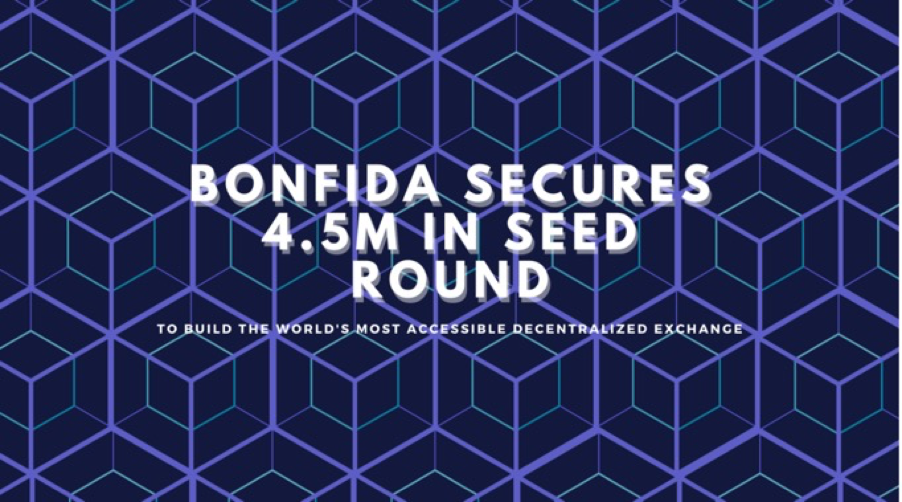
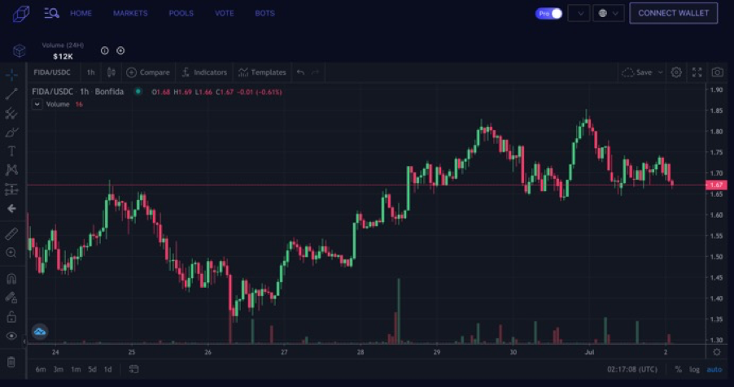

# **Bonfida: The Bonafide Ecosystem Enabler**

By Rahul Nandwani 1st Jul 2021

Struggling with the user experience issues on decentralised exchanges? Craving the ease of centralised exchanges but without the centralisation? Say “Bon Voyage” to these problems and more with Bonfida! Bonfida is a non-custodial, decentralized exchange built on the Solana blockchain's Serum trading protocol, a decentralized exchange based on the Solana blockchain. Similar to their graphical user interface, Bonfida is a project that aims to constantly create products to bridge the divide between Solana, Serum and the user. With its full product suite and by bringing the CEX experience to Serum, Bonfida hopes to provide individuals with the most comprehensive experience possible. Bonfida is now the main user interface for Serum as well. They also bring to the market a sui generis data analytics program, especially for Solana. 

The demand for their products are easy to ascertain, with their API being used by some of the major market makers in the industry, and queries have increased by 25% week over week. While Bonfida's graphical user interface is currently used by over 60% of Serum users. Additionally in the months leading up to its launch in December 2020, they had amassed approximately $4.5 million. CMS Holdings led the seed round, which included notable names including Genesis Block Ventures, Sino Global, Spartan Group, and Three Arrows Capital. Bonafide’s current offerings include their native token FIDA, Bonfida Serum GUI, Serum API, Serum Dashboard, Bonfida Bots and Solible. 

Image Credit: https://bonfida.medium.com/

## **Technology**

### **Bonfida Serum GUI**

Bonfida’s interface that combines a number of useful features, such as trading charts and TradingView data makes it the ideal trading platform for Both novice and advanced traders. These features aid users in acquiring vital analytical information on the exchange's activity, including volume, spread percentage, and total value locked for Serum DEX and Swap. Bonfida's ambition is to remain the Serum GUI's flagship, while constantly re-inventing to stay on top of developments. They constantly take into account feedback that Serum users relay and attempt to address these pain points through innovative features. This user-centric approach has led to them creating the most ideal GUI for Serum.  

Currently, their goal for the GUI is to grow its user base and are attempting to do this through the following methods. Firstly, exclusive markets will be listed on Serum, with the listings managed by the community of FIDA holders. Bonfida’s positive obsession with Serum has allowed them to cultivate strategic relationships with their sister company, Alameda Research, as well. Alameda, managing over $1 billion in digital assets and trading $1-10 billion per day across thousands of products, will provide the liquidity for the exclusive listings. The second customer acquisition feature is to provide on-chain advanced order types. Currently, in the market, users can only utilise limit and market orders. On Serum, Bonfida will create profit and stop-loss orders to foster more trading autonomy to users. Additionally, they will offer both on-chain and off-chain advanced order types, with both requiring users to stake FIDA to gain access. One of Bonfida’s hallmarks is its TradingView charts made with on-chain data which was the first of its kind. While this feature is key for any exchange, they will be introducing two new features, allowing orders to be placed through charts and adding position lining on the charts.  

Using Dexes is still very much a niche concept. To ease the transition for new amateur traders while also supporting more experienced individuals, Bonfida plans to introduce two trading modes for Serum; basic and advanced. The advanced mode will be identical to the existing model, but it will include additional capabilities such as Bonfida Bots and advanced order types. There will be no sophisticated order types or charts in the basic mode, which will be focused on a convert function. The final GUI feature to increase their user base is by monetizing their interface. Bonfida's business model revolves around the fees it will get from orders placed through its interface. However, all fees will be used to fund a FIDA buy and burn; however, FIDA holders will have control over how the fees are spent. 

Image Credit: https://dex.bonfida.org/#/market/

### **Serum API**

Apart from their acclaimed GUI, Bonfida’s API has wide applications as well. The team has designed a backend architecture for Serum that holds all on-chain transactions. By essentially acting as a database of all Serum transactions and has regular use by Coin Market Cap and Coingecko, the API receives more than 6 million requests per day. Most significantly, this helps them to offer a superior user experience. The official Serum GUI, for example, uses the API data to load historical trades for each market. This allows every user connecting to a GUI built on open source code to actually access Bonfida data in the background. This led to the aforementioned on-chain TradingView charts, a feature that competitors are unable to replicate due to Bonfida’s unique position of market dominance through being quick to realise opportunities. 

But continuous improvement is the name of the game at Bonfida. The team will continue to harvest and utilise this data for the benefit of their users, to create the optimal UI/UX. To further its mission of being the bridge between Solana and the user, Bonfida is currently working on an order placement API for serum to allow it to enhance its usability. FIDA will be required to be staked by the API, in return for order placement to work. To facilitate the breaking down of barriers of entry, the protocol plans to offer white label and consultancy services for individuals who hope to begin capitalizing on Serum’s platform but lack the technical know-how to build their own infrastructure. 

Image Credit: https://bonfida.medium.com/ 

### **Serum Dashboard, Bonfida Bots & Solible**

With a myriad of different products and functions, Bonfida has engineered a Serum specific dashboard to incorporate all of the aspects of the Serum ecosystem into one domain. These include GUI, swaps, borrow/lending and staking. Currently, the Serum ecosystem has moving parts spread across several websites. This greatly affects accessibility as it is hard for users to navigate through and discover the Serum ecosystem, increasing barriers of entry. Bonfida will strive to provide a complete Serum experience from a single website, making it everyone's preferred option. This is practicable for them as they already host two major ecosystem components, a Serum GUI and a Serum wallet. 

Another point of contention for new users are trading strategies, powered by unfamiliarity in a fairly volatile market like crypto. Bonfida Bots cast these aspersions aside by automating trading strategies for individuals to use with ease. These employ technical indicators to create Serum trading strategies quickly and easily. There are three ways to use the bots. The first are for individuals who want to use the strategies or rules of others, which can be bought with FIDA. While successful traders can also monetize their rules and even set the fee boundaries. The third option is tokenizing their strategies into SPL tokens. This fosters free flowing idea mobility and rewards those who are creative in coming up with effective strategies. Together with Solible, an NFT exchange built on top of Solana and Serum, these are the products that Bonfida hopes will manufacture a clear bridge between the ecosystem and the individual. 

## **Tokenomics** 

FIDA, Bonfida’s native token, will govern 95% of the net fees generated on Bonfida. These tokens can be utilized for either buying or burning as well. As a transactional tool, FIDA can grant access to the popular API mentioned earlier. They are also the method of currency for Bonfida Bots, Bonfida DEX and Solible listings with market-making services, whitelabels and consulting services. Holding FIDA has several perks as well, which include exclusive API endpoints and lower latency, both of which can be a huge advantage for advanced investors. While those seeking value through ventures can be privy to opportunities in rare Solible markets. The data-centric users can benefit as well from sui generis Solana advanced analytics. Similar to other Solana protocols, a restricted governance model based on the FIDA coin is anticipated to be included in Bonfida. Some parameters, such as product fees, may be altered by a FIDA token governance vote. These will allow for the democratization of decision-making processes. 

## **Team** 

Bonfida was founded by David Ratiney, a French student studying at the University of Cambridge at the time. Ratiney started Bonfida as a part-time project, with a central goal of monetising latency. As time went on, the project’s ambitions evolved to offer anything Serum lacked and hoped to fill those gaps with solutions through features. The sheer potential of Solana and Serum, coupled with the early stage timing of the ecosystem with so much left to be built conveyed to Ratiney the opportunity his protocol presented through its value propositions. Requiring raw data led Ratiney to design his own database to capture the information, which ended up fueling his other features as well. This led to the creation and eventual success of the API, which initiated the chain of events that solidified the Bonfida Foundation as a major force in the Solana ecosystem. 

Image Credit: https://solana.com/defi